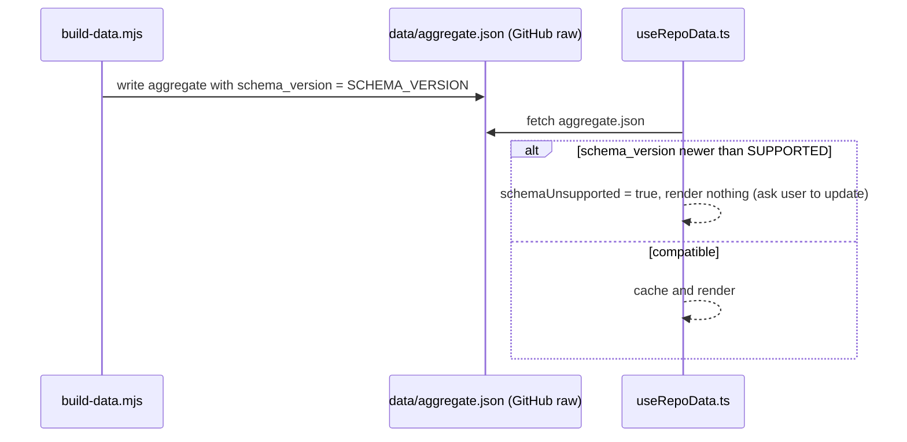

# data/aggregate.json — Frozen Schema Contract

The single contract between the data pipeline and the dashboard: **one file, one fetch,
`schema_version`-gated**. This doc freezes v1 and defines the compatibility rule. Part of M0
(scaling-plan §5.3, §6.4).

---

## 1. Context

`data/aggregate.json` is the pipeline→UI boundary. `build-data.mjs --aggregate` merges the
per-repo training data into one object; the dashboard fetches that one object (repo-as-CDN) and
renders from it. Because it is a single versioned artifact, the only thing standing between a
pipeline change and a broken dashboard is the `schema_version` field — so its meaning must be
pinned, not folklore.

- **Producer:** `ui/scripts/build-data.mjs` — `const SCHEMA_VERSION = 1`.
- **Consumer:** `ui/client/src/hooks/useRepoData.ts` — `const SUPPORTED_SCHEMA_VERSION = 1`.

## 2. Frozen shape — v1

Top-level keys the producer writes and the consumer relies on:

| Key | Type | Produced by | Notes |
|---|---|---|---|
| `schema_version` | number | `SCHEMA_VERSION` const | The gate. Frozen at `1`. |
| `activities` | array | merge of `training/history/*.json` | Falls back to committed `activities.json` if no local history. |
| `challenge_v2` | object | `training/challenge_v2.json` | Quest source of truth (its own contract: validate-repo.py). |
| `current_week` | object | current-week builder | `UNAVAILABLE_CURRENT_WEEK` sentinel when absent. |
| `workouts` | array | sessions/templates | Timer app + dashboard. |
| `sync_status` | object | sync pipeline | Freshness surfacing. |
| `sleep_log` | array | `training/sleep_log.json` | Paired with state.md (validate-repo.py). |
| `quest_history` | object | `quest_history.json` | `{ generated_at, quests }`; `{ "", {} }` when absent. |
| `generated_at` | string (ISO) | build time | Non-contractual; informational. |

## 3. The gate

The consumer blocks render **only** when the aggregate is *newer* than it understands
(`schema_version > SUPPORTED`). Equal or older renders. This is the half-apply guard from
scaling-plan §6.3.

## 4. Compatibility rule (what bumps the version)

- **Additive is free — do NOT bump.** Adding an optional top-level key, or optional fields inside
  an existing object, is backward-compatible. This explicitly includes future **Layer C tracking
  modules** (e.g. a menstrual-cycle or illness module) and new per-sport data surfacing — they
  arrive as additive data, never a version bump. Old dashboards ignore what they don't read.
- **Breaking bumps both, together.** Renaming, removing, or changing the type of a *consumed* key
  is breaking. Bump `SCHEMA_VERSION` **and** `SUPPORTED_SCHEMA_VERSION` in the same change, and
  gate rollout on UI support first (scaling-plan §6.3 — a bump without matching UI strands users).
- **Prefer additive.** When a breaking change is avoidable, make it additive instead.

## 5. Enforcement

`scripts/validate-repo.py` (`check_schema_version_constants`) asserts producer `SCHEMA_VERSION`
== consumer `SUPPORTED_SCHEMA_VERSION` whenever both files are present, and CI runs it via
`validate-data.yml`. A drift between the two constants is an **error** — it means someone bumped
one side only.

## 6. Status

**Frozen at v1.** Both constants read `1` against the current UI and both real repos' data
(`coach-phelps`, and the `coach-phelps-hq` template). Change only via §4.

---

## Appendix — references

Producer: `ui/scripts/build-data.mjs` (`SCHEMA_VERSION`, `buildAggregate()`) · Consumer:
`ui/client/src/hooks/useRepoData.ts` (`SUPPORTED_SCHEMA_VERSION`, `RepoData`) · Enforcement:
`scripts/validate-repo.py` · Data flow: scaling-plan.md §5.3 · Propagation gate: §6.3.
