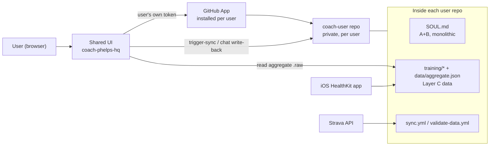
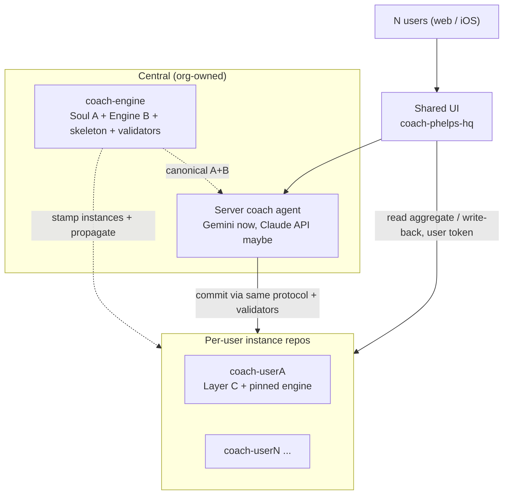
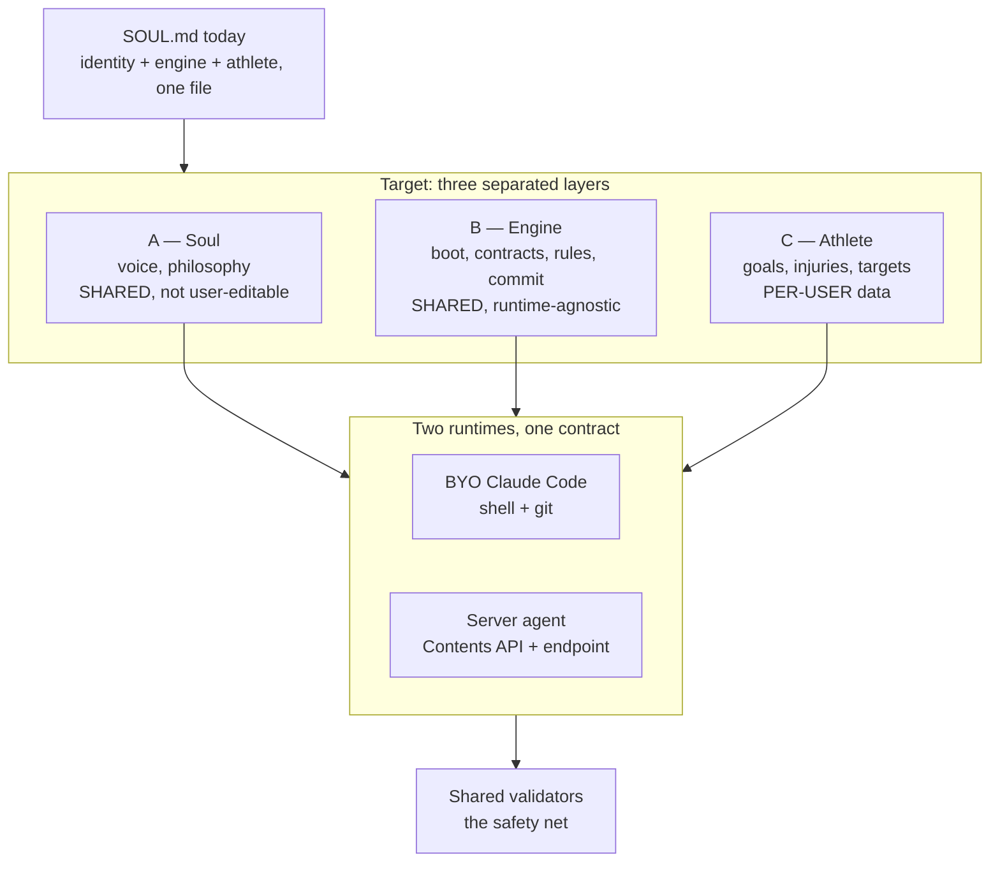
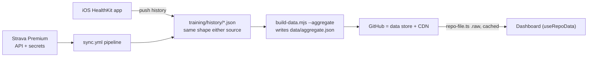
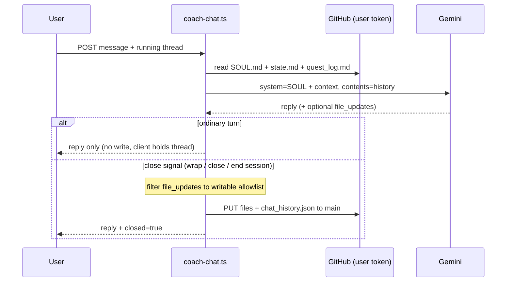
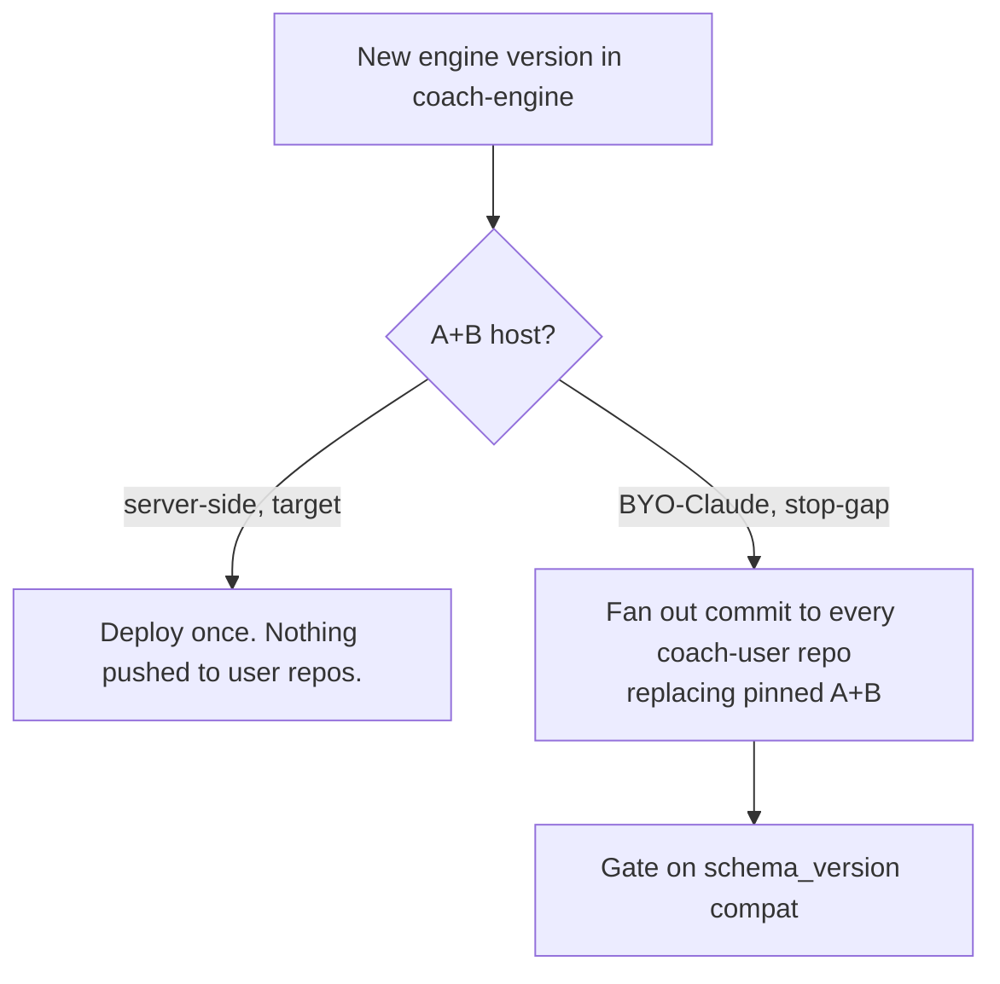
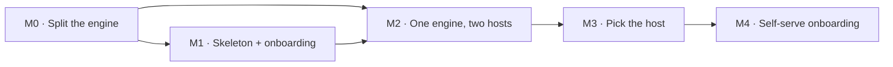

# Scaling Plan — Coach Phelps → Multi-Tenant

Moving Coach Phelps from single-tenant (one hand-built repo per person) to ~10 users on a shared hosted
UI. Supersedes root `/scaling_plan.md`.

---

## 1. Context

Coach Phelps today is one person's repo: a `SOUL.md` persona, Strava/HealthKit data, a sync pipeline, and
a dashboard, all driven by a Claude Code session. We want ~10 F&F users on **one shared site**, each with
private data, without building a social product.

The hard parts are identity (whose data?), access (read/write the right repo, only theirs), and the coach
itself (one shared Phelps, per-user data, runnable as a local Claude session *and* a server agent). The
identity/access layer is built; the coach-as-a-service layer is half-built and is where the work remains.

**Permanent non-goal:** any cross-user / social feature. The per-repo install model enforces it — leave
no seam.

---

## 2. Current State

### 2.1 Built

| Capability | State | Where |
|---|---|---|
| GitHub App auth (user-to-server OAuth + PKCE) | Done, hardened | `ui/api/auth-*.ts` |
| User → repo resolution (ownership-filtered) | Done | `ui/api/list-my-repos.ts` |
| Runtime data load ("repo-as-CDN") | Done | `ui/api/repo-file.ts`, `hooks/useRepoData.ts` |
| Sync trigger from UI | Done | `ui/api/trigger-sync.ts` |
| **Server coach (Gemini) + write-back at close** | **Built** | `ui/api/coach-chat.ts` |
| Dual-path ingestion (Strava / iOS) | Working | `.github/workflows/sync.yml` |
| Direct-to-main data validation | JSON-parse only | `.github/workflows/validate-data.yml` |

Three load-bearing facts: every GitHub call uses the **signed-in user's own token**, App-scoped to their
one repo (Contents R/W + Actions R/W) — no shared PAT. **Sessions are stateless** (encrypted 8h cookie, no
DB). **Layer C is already data** (`state.md`, `challenge_v2.json`, `coach_notes.md`, `sleep_log.json`) —
a head start on the split.

### 2.2 Gaps

- **No skeleton onboarding.** Login assumes the user already owns a repo with the marker file (#32).
- **`SOUL.md` is one 384-line file, per repo** — layers entangled, no central version, no propagation.
- **The server coach is a *second* engine.** `coach-chat.ts` re-encodes Layer B in TS + a prompt that
  dumps `SOUL.md` at Gemini. BYO-Claude and Gemini now run *different copies* of the rules — the central
  risk (§7/§8).
- **Engine isn't runtime-agnostic** (boot assumes shell/git/python); validators only check JSON parses.
- **Stale docs** (root README/SETUP describe the old self-host flow) and a **naming/legal** issue (§8).

---

## 3. Goal State

One shared UI, N private instance repos, one central coach whose engine executes identically on either
runtime, with validators as the shared safety net.

Users never edit A or B. Each user's data is isolated (no query spans users). Moving the coach from
BYO-Claude to fully server-side is a *hosting* change, not a rewrite.

---

## 4. Assumptions & Locked Decisions

Settled — build on these: 2 new repos (UI + skeleton) + N per-user instances; GitHub App installed per
user; one shared Phelps, versioned centrally, not user-editable; fresh skeleton (original archived);
SOUL = three separated layers with B runtime-agnostic; athlete is *data*, not identity; dual-path
ingestion (Strava **or** iOS), same downstream shape; no social features, ever.

**Deferred (flagged, not decided here):**

- **Where A+B physically live at target** — gated on whether server-side coaching (Gemini, maybe metered
  Claude API) proves worth it. **BYO-Claude is an explicit stop-gap.** Only the server-side variant gives
  a real IP boundary.
- **Auto-provisioning.** MVP onboarding is **operator-run** (we hold the skeleton, clone + set up by
  hand). Self-serve needs Administration + Secrets App permissions — later.

---

## 5. High-Level Design

### 5.1 Topology

| Repo | Contains | Written by |
|---|---|---|
| `coach-phelps-hq` (UI) | Shared dashboard + `ui/api/*`. The only UI. No per-user data. | Engineering (PR) |
| `coach-engine` (skeleton/canonical) | Soul A + Engine B + skeleton tree + workflows + validators. Source for new instances and propagation. | Engineering (PR) |
| `coach-<user>` (instance) | Layer C data + history + pinned engine. One per user. | Coach + sync pipeline |

### 5.2 The 3-way SOUL split

**Landed in M0** (ADR `kdb/decisions/0004`, detail `docs/soul-split-m0.md`). Sources of truth are three files under `soul/`; `SOUL.md`
becomes a *generated* composition of them, so the read path (Claude Code boot, `coach-chat.ts`) is
unchanged and no live session breaks.

| Layer | Source file | From SOUL.md |
|---|---|---|
| A — Soul | `soul/A_identity.md` | §3–6 (identity, voice, philosophy, playbook) |
| B — Engine | `soul/B_engine.md` | §1–2, §9–13 (+ mechanics pulled out of §5–6), as capability contracts |
| C — Athlete | `soul/C_athlete.md` | §7–8 (schema + generic intake) |

Reconciled against the **live v5.6 engine** (`coach-phelps`), not just the v1.0 hq template — so
`current_week.json` (structured weekly plan), Weekly Contract Safety, analytics usage, archive
mechanics, visualization/voice references, and the graduated-habit lifecycle are all in B; parity is
checked against both baselines. Composed SOUL is v6.0.

`scripts/compose-soul.mjs` builds `SOUL.md` (CI enforces no drift). B declares capability verbs
(`SYNC`/`READ`/`QUERY_ACTIVITY`/`TIME`/`WRITE_ATOMIC`/`VALIDATE`/`VALIDATE_WEEK`/`REGENERATE`/`COMMIT`) bound
per-runtime, and is a **generic interpreter over Layer C data** — sports (`sports[]`), acute
`injury_flags[]` vs chronic `conditions[]`, and open-ended auto-regulation signals — so new sports,
conditions, and tracking modules land as additive data, not engine edits. Athlete specifics are
stripped from A/B; first-session is generic intake that *populates* C (and pulls ~1yr of history to
learn the athlete's rhythm). `scripts/validate-repo.py` enforces the guarantees regardless of who
ran the commit (graduated ERROR/WARNING); `scripts/parity-check.py` proves no v1 rule was dropped.

### 5.3 Data flow

The aggregate is the pipeline↔UI contract: one file, one fetch, `schema_version`-gated. Both sources are
interchangeable. Holds fine at ~10 users; it's the piece §9 eventually outgrows.

---

## 6. Low-Level Design

### 6.1 Auth (built — don't regress)

Two hardening details are load-bearing: installation resolution matches on **`app_slug` AND
`account.login`** (app-only matching once leaked a collaborator to the owner's install, #30), and repo
candidates are filtered to **`owner.login === session.login`** (ownership, not access). Deferred perms to
bundle into one re-consent: **Administration** (API-create repo) + **Secrets** (write Strava secrets).

### 6.2 Server coach write-back (`coach-chat.ts`) — built

No DB (repo is the only store); commit once at a keyword close-trigger; writable-file allowlist as
defense-in-depth; single shared `GEMINI_API_KEY` (free tier, 429-handled). **The problem:** this endpoint
is a second copy of B — rules living only in its prompt (verbatim reproduction, close trigger, allowlist)
are enforced differently by BYO-Claude. Collapsing the two into one shared B + one validator is the core
milestone (§7). Until then, Gemini reproducing a 14KB `state.md` is one truncation from data loss, with
only a JSON-parse check guarding it.

### 6.3 Skeleton, onboarding, propagation

Onboarding is operator-run — a `provision-user.sh` that creates `coach-<user>` from `coach-engine`, sets
the sync source, seeds empty Layer C; the user then installs the App and runs intake. Propagation depends
on the deferred host:

### 6.4 Validators

Extend `validate-data.yml` from JSON-parse-only to the **full file contracts** (required `state.md`
sections, `challenge_v2.json` schema, sleep-log pairing, session shape). This is what makes "either
runtime, executed identically" real — server-written and human-written commits pass the same gate. Highest
priority, because write-back is already live.

---

## 7. Milestones

Each milestone is a shippable outcome with a clear exit test, not a work log.

| # | Size | Milestone | Done when (exit test) |
|---|---|---|---|
| **M0** | **L** | Split the engine | `SOUL.md` is separated into A / B / C; B is capability-contract form (no shell/git assumptions); `validate-data.yml` enforces the full file contracts; aggregate `schema_version` is frozen and documented. |
| **M1** | **M** | Skeleton + onboarding | A new F&F user goes from zero to a working BYO-Claude coach via `provision-user.sh` in one sitting; the original repo is archived; root README/SETUP describe the hosted flow. |
| **M2** | **L** | One engine, two hosts | `coach-chat.ts` and a BYO-Claude session execute the *same* shared B and pass the *same* validator — no coaching rule lives only in the endpoint prompt. |
| **M3** | **S** | Pick the host | The A+B location decision is made from M2 feedback (server-only / BYO / hybrid), and §4/§6 are updated to match. |
| **M4** | **M** | Self-serve onboarding | A user self-provisions on first login: repo created + secrets written automatically (Administration + Secrets perms granted); the operator step is gone. |

Sizing is rough (S = a sitting, M = a few sessions, L = a real chunk of focused work). M0 and M2 are the
heavy lifts and the critical path; M3 is mostly a decision.

Ordering: M0 unlocks everything (a runtime-agnostic engine + real validators is what makes both hosts
safe). M1 gets real users on the stop-gap and generates the feedback M2/M3 need. M4 is deliberately last —
polish over a manual step that already works. M2's write-back safety (extending the validator) is the
single highest-priority item, since the server coach already writes to repos today.

---

## 8. Risks & Open Questions

- **Naming/legal — blocks public launch.** "Coach Phelps" references a real, litigious public figure
  (right of publicity; Lanham Act). Zero exposure while private; real the moment it's shareable. Rename
  the persona (not the concept) with runway.
- **Server vs. human execution must match — and write-back is live.** `coach-chat.ts` already writes via a
  re-encoded B; the validator (§6.4) must become the shared gate. Highest-priority hardening.
- **IP boundary unresolved by design.** Local BYO-Claude and "hide the engine" are mutually exclusive;
  resolved only by going server-side (M2/M3).
- **Shared Gemini key = shared cost + rate limit.** One free-tier key for all users; a ceiling as users
  grow; feeds the funding question.
- **Propagation half-apply.** A `schema_version` bump without matching UI support strands users; gate it
  (§6.3), prefer additive changes.
- **Data-store ceiling.** Repo-as-CDN is fine at 10; unbounded history + API limits force §9 later.
- **Later calls:** collaborator dashboard sharing (recommend explicit owner opt-in only); per-user page
  config (#13); Android sync; funding path for centralized model cost.

---

## 9. Long-Term Vision (rough)

Not committed; recorded so the design doesn't box us in.

- **Scale to ~10k users:** a real backend (Postgres + object store) behind the *same* aggregate contract,
  with GitHub demoted to an optional sync target.
- **Web + iOS:** narrative dashboards and configurable widgets (per-user config lives in Layer C).
- **iOS app:** Apple Watch companion + auto-sync, becoming the primary ingestion path.
- **Ultimate — coach watches sync:** it pre-reads each new activity and drops a `coach_comment` for the
  UI — a server agent executing B on a sync webhook, which is exactly why B must be runtime-agnostic.
  Everything in M0–M3 is on that path.

---

## Appendix — file / endpoint references

Auth: `ui/api/auth-*.ts`, `_lib/session.ts`, `_lib/pkce.ts` · Repo resolution: `list-my-repos.ts` ·
Runtime data: `repo-file.ts`, `hooks/useRepoData.ts` · Sync: `trigger-sync.ts` · Server coach:
`coach-chat.ts` · Build: `build-data.mjs --aggregate` · Workflows: `sync.yml`, `apply-coach-patch.yml`,
`validate-data.yml` · Engine (to split): `SOUL.md` · Prior: `docs/website-unification-history.md`.
