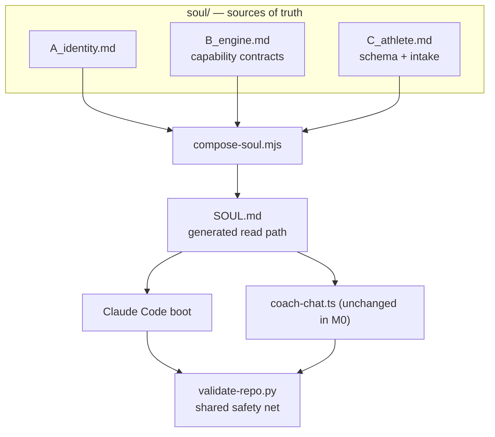

# M0 — SOUL split: implementation note

**Formal decision:** `kdb/decisions/0004-three-layer-soul-split.md` (this note is the long-form detail).
**Status:** Accepted — M0 (scaling-plan.md §7). **Date:** 2026-07-24.
**Supersedes:** the monolithic `SOUL.md` as the source of truth (it becomes a generated artifact).

---

## Context

`SOUL.md` was one ~385-line file per repo mixing three concerns: the coach's identity/voice, the
operating engine (boot, rules, workflows, commit), and the athlete's own data. Two runtimes must
run the *same* coach — a BYO Claude Code session (shell + git) and a server agent
(`ui/api/coach-chat.ts`, Contents API) — but the engine assumed shell/git/python, and
`coach-chat.ts` re-encodes the rules in its own prompt. Validators only checked that JSON parsed.
This is the central risk in scaling-plan §2.2 / §8: two engines drifting, guarded by nothing.

Locked going in (scaling-plan §4, **not reopened here**): three separated layers with B
runtime-agnostic; athlete is *data, not identity*; one shared engine, versioned centrally, not
user-editable; where A+B physically live at target is *deferred* (gated on the server-side
decision, M3).

## Source lineage — reconciled against v5.6, not v1.0

The split was **reconciled against the live v5.6 engine** (Akash's `coach-phelps`), not just the
v1.0 hq template it was first drafted from. v1.0 was behind: it lacked the structured
`current_week.json` weekly-plan artifact, analytics usage, archive mechanics, visualization/voice
references, and the graduated-habit lifecycle. All of those generic engine capabilities are in B;
their athlete-/sport-specific content (Sky's profile, day→template lookup, opponent notes,
milestone content) stays in Layer C / sport-packs. Parity is checked against **both** baselines
(`docs/parity/soul-v1-baseline.md` and `soul-v5.6-baseline.md`). Composed SOUL is **v6.0**.

## Decision

**1. Three layers, each a file under `soul/`.**

| Layer | File | Contents | Source (v1.0 §, + v5.6) |
|---|---|---|---|
| A — Soul | `soul/A_identity.md` | identity, voice, philosophy, seasons framing, playbook | §3–6 |
| B — Engine | `soul/B_engine.md` | boot, file contracts, quest rules (+ graduated habits), rules engine, workflows, tools, commit — **and v5.6's** `current_week.json` model, Weekly Contract Safety, analytics usage, archive, visualization/voice refs | §1–2, §9–13 + v5.6 §10 |
| C — Athlete | `soul/C_athlete.md` | per-user data *schema* (incl. `current_week.json`, analytics, archive, sport-packs) + generic first-session intake | §7–8 + v5.6 artifacts |

**2. `SOUL.md` becomes a generated composition (backward compat).** `scripts/compose-soul.mjs`
concatenates A+B+C into `SOUL.md`. Every reader — a Claude Code boot and `coach-chat.ts` — keeps
reading `SOUL.md` wholesale, so **the split does not change the read path**; no live session
breaks mid-rollout. CI (`validate-data.yml`) enforces `SOUL.md == compose(A,B,C)`. Output is
deterministic (no timestamps) so the drift check is stable.

**3. B is a capability contract, not a script.** B declares *what* must happen via verbs — `SYNC`,
`READ`, `QUERY_ACTIVITY`, `TIME`, `WRITE_ATOMIC`, `VALIDATE`, `VALIDATE_WEEK`, `REGENERATE`, `COMMIT` — each bound
to a concrete primitive per runtime in a binding table. The Claude Code binding preserves today's
exact commands (behavioral parity); the server-agent binding (Contents API) is the M2 target.
`WRITE_ATOMIC → VALIDATE → COMMIT` is one transaction; no partial pushes.

**4. B is a generic interpreter over Layer C domain data — the extensibility principle.** B
hardcodes no sport, injury, or tracking signal. Auto-regulation reads *signals* (fatigue, PRE
score, acute flags, chronic-condition contraindications, and reserved future signals like
cycle-phase) and applies *modifiers*; sports are a `sports[]` list with per-sport packs; chronic
`conditions[]` are split from acute `injury_flags[]`. This is what lets the 10→1000 futures
(female-athlete cycle tracking, new sports, RA-style chronic load management) land as **additive
Layer C data**, never a B rewrite. M0 builds the *shape* (the "medium" seam); the *content*
(rule libraries, sport packs, cycle module) is deferred.

**5. Validators are the shared safety net, graduated.** `scripts/validate-repo.py` enforces the
full file contracts (state.md sections, challenge_v2 schema, sleep-log pairing, session shape,
SOUL drift, schema_version constants). Severity is graduated: **ERROR** for universal load-bearing
contracts both real repos satisfy; **WARNING** for real but pre-existing drift — so extending the
net never reds a live repo on a false positive. Both runtimes pass the same gate.

**6. `data/aggregate.json` schema_version is frozen at v1** — see `docs/aggregate-schema.md`.

## Flagged for M2 — rules that today live ONLY in `coach-chat.ts`

Not fixed here (collapsing the second engine is M2). Each is a Layer-B rule the endpoint
re-encodes in its own TS/prompt, enforced differently from a Claude Code session:

- **Close-session trigger** — `CLOSE_SESSION_PATTERN` regex decides when the commit protocol runs.
- **Writable-file allowlist** — `COACH_WRITABLE_FILES` / `isCoachWritable()` (mirrors B §2, drifts independently).
- **"Never claim saved unless written"** — prompt rule with no analogue in B's text.
- **Skip-boot instruction** — tells Gemini to skip the Boot Sequence (mid-conversation).
- **Timezone extraction** — re-implements boot §6's `TZ=<tz> date` by parsing state.md.
- **Commit-message cleaning** — `cleanCommitMessage()` strips model-added prefixes.

M2 exit test: `coach-chat.ts` and a Claude Code session execute the *same* B and pass the *same*
validator, with no coaching rule living only in the endpoint prompt.

## Consequences

- **Good:** one source of truth per concern; read path unchanged; a real regression net (parity +
  validators); futures are additive; B is executable-in-principle on both runtimes.
- **Cost:** `SOUL.md` is now generated — contributors edit `soul/*.md` and run compose (CI guards
  forgetting). B's contract wording is a layer of indirection over bare commands (bindings keep it
  concrete).
- **Pre-existing drift surfaced (not caused):** Akash's `state.md` lacks `Athlete Profile` /
  `Current Week Plan` headings and his `sleep_log.json` is empty while the table is populated;
  his `challenge_v2.json` uses `season`/`phase` instead of a `challenge{}` block with a
  non-`count_target` main quest. All surface as validator **warnings** — real reconciliation work,
  tracked separately, not M0 blockers.

## Deferred (locked elsewhere, not decided here)

Physical home of A+B at target (server-side vs BYO — M3); wiring the server agent to execute B
(M2); propagating the split into the live instance repos (M1 provisioning); the persona
rename/legal item (scaling-plan §8).

---

## Appendix — artifacts M0 introduces

`soul/A_identity.md`, `soul/B_engine.md`, `soul/C_athlete.md` · `scripts/compose-soul.mjs` ·
`scripts/validate-repo.py` · `scripts/parity-check.py` · `docs/parity/soul-v1-baseline.md` ·
`docs/aggregate-schema.md` · `.github/validation-fixtures/{valid,broken}/` ·
`.github/workflows/validate-data.yml` (extended).
