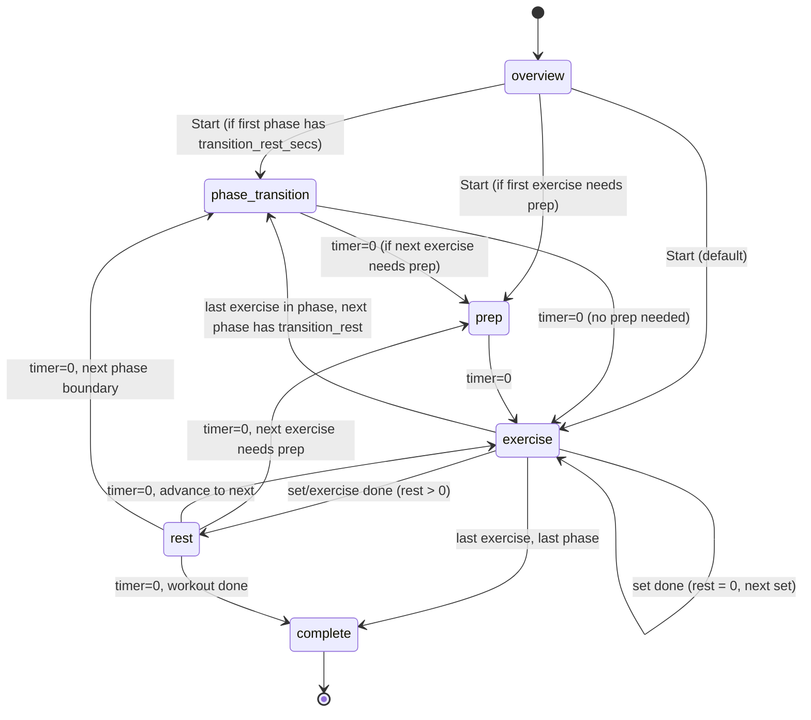

# Timer State Machine — WorkoutTimer.tsx

**Version:** v1.1 — Apr 4, 2026
**Source of truth:** `client/src/pages/WorkoutTimer.tsx`

---

## 1. States

| State | Description | Timer counts down? | On timer = 0 |
|-------|-------------|-------------------|--------------|
| `overview` | Workout preview screen | No | — (user clicks Start) |
| `phase_transition` | Blue screen between phases (equipment change, mental reset) | Yes | `enterExercise(firstEx)` |
| `prep` | "GET READY" countdown before timed exercises | Yes | → `exercise` |
| `exercise` | Active exercise — timed countdown or reps (manual done) | Timed only | `handleExerciseDone()` |
| `rest` | Rest between sets or exercises, shows "UP NEXT" / "NEXT SET" | Yes | `advanceToNext()` |
| `complete` | Workout finished | No | — |

## 2. State Transition Diagram



## 3. The `-1 Sentinel` Pattern

**Problem:** React's `useEffect` for the countdown tick and the timer initialization effect both depend on `state`. When state changes, both re-run. If the tick effect runs first and sees `timer=0` (leftover from previous state) + the new state, it immediately fires the completion handler — skipping the exercise entirely.

**Solution:** Before ANY `setState()` call, always call `setTimer(-1)` first.

```typescript
// CORRECT — always reset timer before state change
setTimer(-1);
setState("exercise");

// WRONG — tick effect may fire with timer=0 + new state
setState("exercise");
```

The tick effect guards against this:
```typescript
if (timer < 0) return;  // Wait for timer init effect to set the real value
```

The timer initialization effect then sets the correct value on the next render cycle:
```typescript
useEffect(() => {
  if (state === "exercise" && exercise?.type === "timed") {
    setTimer(exercise.duration_secs ?? 0);
  }
  // ... other states
}, [state, pos, exercise, phase]);
```

**Rule:** Every code path that calls `setState()` MUST call `setTimer(-1)` immediately before it. No exceptions. This includes `handleGoBack`, `handleSkip`, `handleSkipOptional`, `handleExerciseDone`, and the tick effect's own state transitions.

## 4. The `advancingRef` Guard

**Problem:** Double-advancement can occur when multiple effects or callbacks fire in the same render cycle, both trying to advance the position.

**Solution:** `advanceToNext()` uses a ref-based guard:

```typescript
const advanceToNext = useCallback(() => {
  if (advancingRef.current) return;  // Already advancing
  advancingRef.current = true;
  // ... advancement logic
}, [...]);
```

The guard is reset by a `useEffect` that observes state and position changes:
```typescript
useEffect(() => {
  advancingRef.current = false;
}, [state, pos]);
```

**Rules:**
- `handleExerciseDone()` does NOT set `advancingRef` — it either sets state directly (rest, phase_transition, complete) or delegates to `advanceToNext()` which has its own guard
- Never call `advanceToNext()` from code that already holds `advancingRef` — this causes a deadlock where the nested call sees the guard and returns immediately

## 5. Key Functions

| Function | Purpose | Sets `advancingRef`? |
|----------|---------|---------------------|
| `enterExercise(ex?)` | Safe entry point — resets timer, enters prep or exercise | No |
| `handleExerciseDone()` | One set completed — decides rest, phase transition, or advance | No |
| `advanceToNext()` | Advances position (set → exercise → round → phase → complete) | Yes |
| `getRestDuration()` | Returns correct rest: between-sets vs between-exercises | N/A |
| `handleGoBack()` | Navigate backward (set, exercise, round, phase) | No |
| `handleSkip()` | Skip current state — rest/prep skips forward, exercise triggers done | No |
| `handleSkipOptional()` | Skip entire optional exercise (all remaining sets) | No |

## 6. Rest Duration Hierarchy

```
getRestDuration():
  if circuit mode → phase.default_rest_secs
  if between sets (setNum < exercise.sets) → exercise.rest_between_sets_secs ?? phase.default_rest_secs
  if between exercises (last set done) → exercise.rest_after_exercise_secs ?? phase.default_rest_secs
```

**Phase transition takes priority:** When the last exercise in a phase finishes and the next phase has `transition_rest_secs > 0`, `handleExerciseDone` skips the normal rest and goes directly to `phase_transition`. This prevents double-rest (exercise rest + phase transition rest).

## 7. Timer Physics Fields

These fields control the timer's physical behavior. Set in template JSON, read at runtime.

| Field | Level | Type | Default | Effect |
|-------|-------|------|---------|--------|
| `prep_secs` | Exercise | number | 0 | "GET READY" countdown before timed exercises. Min 5s when set. Ignored for reps. |
| `rest_after_exercise_secs` | Exercise | number | `default_rest_secs` | Rest after last set of this exercise. Overrides phase default. |
| `rest_between_sets_secs` | Exercise | number | `default_rest_secs` | Rest between sets of same exercise. |
| `transition_rest_secs` | Phase | number | — | Rest before this phase begins. Blue "phase transition" screen. |
| `optional` | Exercise | boolean | false | Shows amber "SKIP" button. Can skip all remaining sets. |
| `both_sides` | Exercise | boolean | false | Timer runs `duration_secs` twice per set — once per side. No rest between sides. Side label shown on screen ("LEFT → RIGHT"). Ignored for `type: "reps"`. |
| `default_rest_secs` | Phase | number | — | Fallback rest duration for the phase. |

## 8. Keyboard Shortcuts

| Key | Exercise (reps) | Exercise (timed) | Rest / Prep / Transition |
|-----|----------------|-------------------|--------------------------|
| Space | Done (= Enter) | Pause/Resume | Pause/Resume |
| Enter | Done | Done (early finish) | — |
| → | Skip (= Done) | Skip (= Done) | Skip to next |
| ← | Go back | Go back | Go back |
